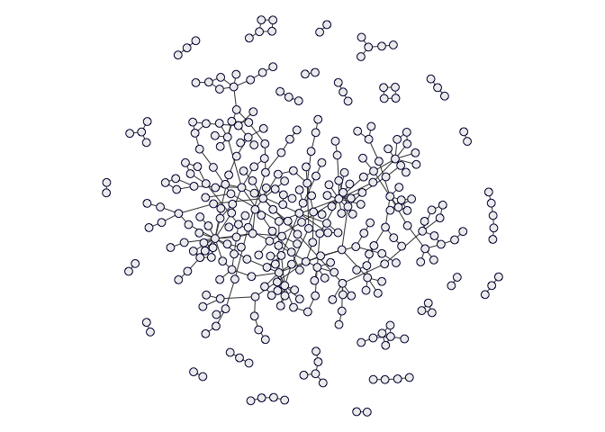
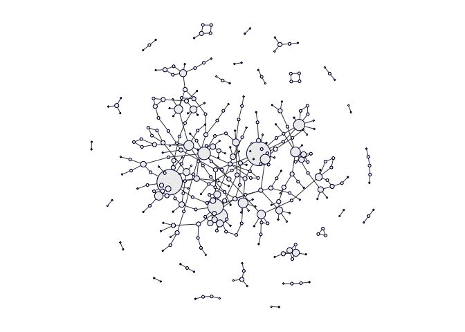
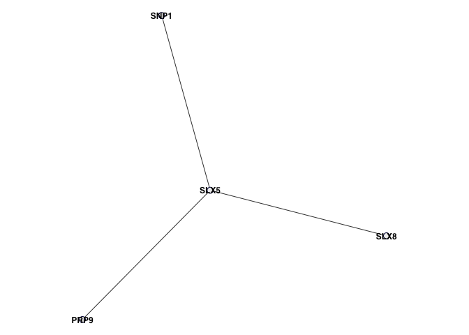
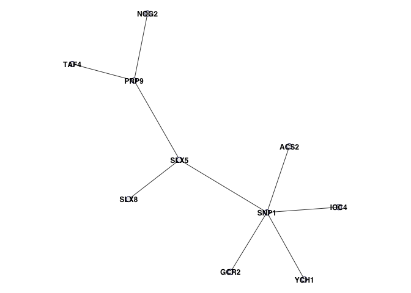
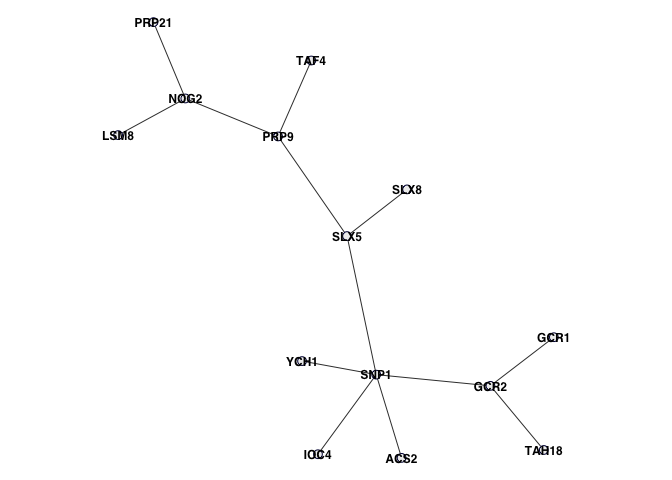
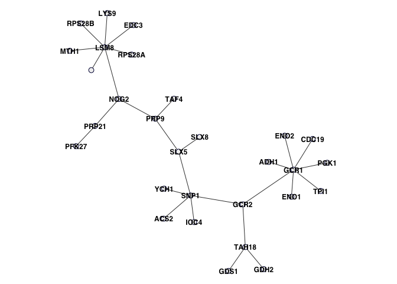
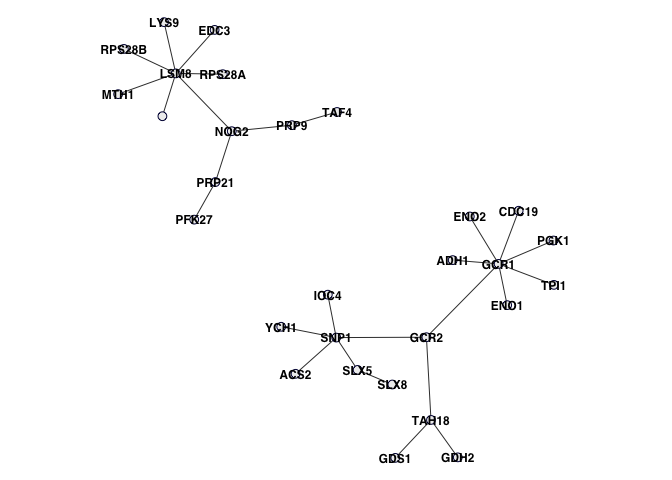
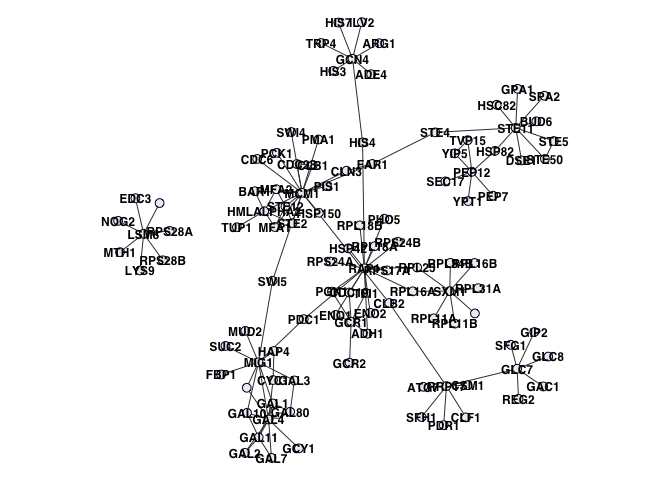
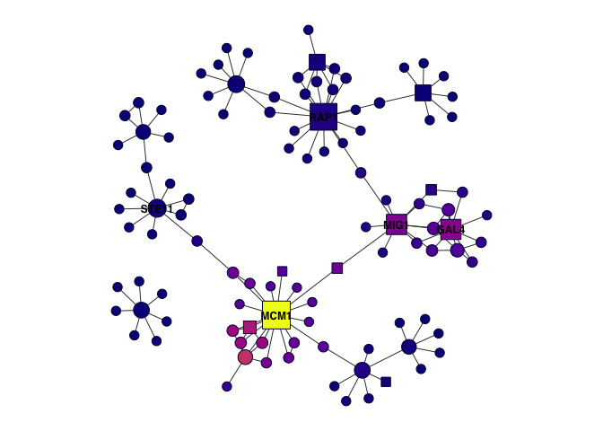
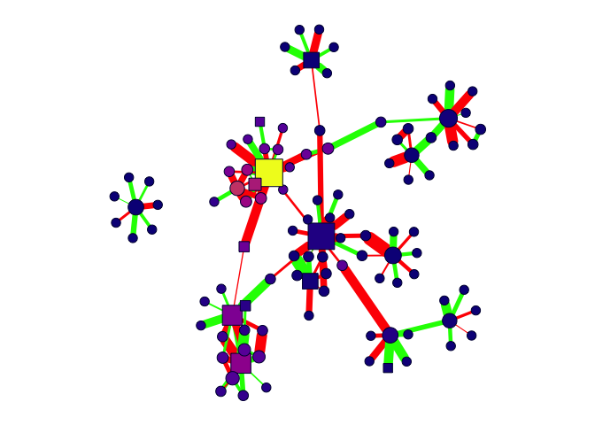

<!-- README.md is generated from README.Rmd. Please edit that file -->

# Omics Network Objects

## Input data

The input for omics network objects is an `igraph` object. It can be
undirected, directed, or weighted however the emphasis of these methods
are on undirected networks.

``` r
data(omics)
print(omics)
```

    #> IGRAPH 2188627 UN-- 331 362 -- 
    #> + attr: name (v/c), label (v/c), is_tf (v/l), lfc_rna (v/n), snp_frq
    #> | (v/n), cor (e/n)
    #> + edges from 2188627 (vertex names):
    #>  [1] 749--751 749--109 743--692 740--737 740--452 737--454 737--637 735--702
    #>  [9] 733--398 717--256 715--288 711--442 708--747 708--707 704--177 704--176
    #> [17] 702--529 692--694 692--212 690--544 688--234 686--215 683-- 79 674--243
    #> [25] 668--262 666--285 664--622 662--261 659--578 659--153 659--729 659--727
    #> [33] 659--725 659--134 659--722 659--657 657--577 646--648 646--122 643--371
    #> [41] 643--366 640--545 640--329 631--186 631--185 629--230 622--416 620--603
    #> [49] 215--618 618--617 615-- 62 615--614 612--300 612--294 285--612 609--325
    #> + ... omitted several edges

Vertex names must be unique.

``` r
head(igraph::V(omics)$name)
```

    #> [1] "749" "751" "109" "743" "692" "740"

Optionally you can annotate the edge and node properties of your input.
These can be used to filter nodes, edges, or subset your network in
downstream methods.

``` r
head(igraph::V(omics)$label)
```

    #> [1] "MTH1"  "SNF3"  "LSM8"  "ASN1"  "SPC24" "GIP2"

``` r
head(igraph::E(omics)$cor)
```

    #> [1] -0.5491788 -0.1286078  0.4775522 -0.1169985  0.2564625  0.3313050

## Initialize objects

To create an omics network object, you can simply pass it your `igraph`
object.

``` r
n <- omics.network$new(omics)
n$peek()
```

    #> Omics Network Object
    #> IGRAPH 2188627 UN-- 331 362 -- 
    #> + attr: name (v/c), label (v/c), is_tf (v/l), lfc_rna (v/n), snp_frq
    #> | (v/n), cor (e/n), name (e/c)
    #> + edges from 2188627 (vertex names):
    #>  [1] 749--751 749--109 743--692 740--737 740--452 737--454 737--637 735--702
    #>  [9] 733--398 717--256 715--288 711--442 708--747 708--707 704--177 704--176
    #> [17] 702--529 692--694 692--212 690--544 688--234 686--215 683-- 79 674--243
    #> [25] 668--262 666--285 664--622 662--261 659--578 659--153 659--729 659--727
    #> [33] 659--725 659--134 659--722 659--657 657--577 646--648 646--122 643--371
    #> [41] 643--366 640--545 640--329 631--186 631--185 629--230 622--416 620--603
    #> [49] 215--618 618--617 615-- 62 615--614 612--300 612--294 285--612 609--325
    #> + ... omitted several edges

Optionally you can provide functions for computing node/edge properties
like centrality measures. Rather than annotating your igraph with these
measures beforehand, by providing the functions directly, they can be
used to update node/edge measures if the graph changes. For example, if
you delete edges, remove nodes, or subset your graph, you may want to
recompute all of your centrality measures.

``` r
# Really simple
node.degree <- function(ig) igraph::degree(ig)

# Specific parameters
node.eigen <- function(ig) igraph::eigen_centrality(ig, directed=FALSE)$vector
edge.betweenness <- function(ig) igraph::edge_betweenness(ig, directed=FALSE)

# More complicated 
edge.routes <- function(ig) {
    paths <- suppressWarnings(shortest_paths(ig, V(ig), V(ig), output="epath")$epath)
    counts <- mapply(function(p) {
        igraph::as_ids(p)
    }, paths, SIMPLIFY=FALSE, USE.NAMES=TRUE) %>%
    unlist() %>%
    table()
    return(unname(replace_nas(counts[as_ids(E(ig))], 0)))    
}

node.fn <-list("degree"=node.degree, "eigen"=node.eigen)
edge.fn <- list("betweenness"=edge.betweenness, "routes"=edge.routes)

n <- omics.network$new(omics, node.fn=node.fn, edge.fn=edge.fn)
n$peek()
```

    #> Omics Network Object
    #> IGRAPH 2188627 UN-- 331 362 -- 
    #> + attr: name (v/c), label (v/c), is_tf (v/l), lfc_rna (v/n), snp_frq
    #> | (v/n), degree (v/n), eigen (v/n), cor (e/n), name (e/c), betweenness
    #> | (e/n), routes (e/n)
    #> + edges from 2188627 (vertex names):
    #>  [1] 749--751 749--109 743--692 740--737 740--452 737--454 737--637 735--702
    #>  [9] 733--398 717--256 715--288 711--442 708--747 708--707 704--177 704--176
    #> [17] 702--529 692--694 692--212 690--544 688--234 686--215 683-- 79 674--243
    #> [25] 668--262 666--285 664--622 662--261 659--578 659--153 659--729 659--727
    #> [33] 659--725 659--134 659--722 659--657 657--577 646--648 646--122 643--371
    #> [41] 643--366 640--545 640--329 631--186 631--185 629--230 622--416 620--603
    #> + ... omitted several edges

## Node and edge attributes

The way to think about node and edge properties is that there is an
attributes data frame that has a one-to-one mapping to nodes and edges
in the graph. These data frames or attributes tables are not data
elements in the object but they are created, manipulated, and destroyed
on the fly.

``` r
head(n$nodes.attributes())
```

    #>     name label is_tf    lfc_rna     snp_frq degree        eigen
    #> 749  749  MTH1 FALSE -0.4385177 0.035319994      2 5.773461e-07
    #> 751  751  SNF3 FALSE  0.1285503 0.003035238      1 1.136718e-07
    #> 109  109  LSM8 FALSE -0.5849400 0.062844766      7 2.818706e-06
    #> 743  743  ASN1 FALSE  1.1166966 0.229042875      1 2.246342e-04
    #> 692  692 SPC24 FALSE  0.2306554 0.009771783      3 1.140931e-03
    #> 740  740  GIP2 FALSE -0.5743279 0.060585153      2 2.907297e-03

``` r
head(n$edges.attributes())
```

    #>      name from  to        cor betweenness routes
    #> 1 749|751  749 751 -0.5491788         248      1
    #> 2 749|109  749 109 -0.1286078         494    247
    #> 3 743|692  743 692  0.4775522         248      1
    #> 4 740|737  740 737 -0.1169985        1373     12
    #> 5 740|452  740 452  0.2564625        1587     13
    #> 6 737|454  737 454  0.3313050        1481      0

The `name` attribute is really important and will always be there. These
are unique identifiers that you can use to query the `igraph` object
with if necessary.

``` r
igraph::shortest_paths(n$ig, from="387", to="109")$vpath
```

    #> [[1]]
    #> + 7/331 vertices, named, from 2188627:
    #> [1] 387 391  99 122 646 119 109

Querying with the node and edge identifiers is not very practical, you
usually want to use symbols or other recognizable labels. Don’t worry
about the next few lines of code, it’s just to demonstrate how to use
the attribute getter functions to figure out that we just found the
shortest path between genes GCR1 and LSM8.

``` r
n$nodes("label")[match("387", n$nodes("name"))]
```

    #> [1] "GCR1"

``` r
n$nodes("label")[match("109", n$nodes("name"))]
```

    #> [1] "LSM8"

You can also do edges

``` r
head(n$edges("name"))
```

    #> [1] "749|751" "749|109" "743|692" "740|737" "740|452" "737|454"

``` r
head(n$edges("betweenness"))
```

    #> [1]  248  494  248 1373 1587 1481

You can also add annotations. Note: These will not be updated if the
graph is changed becuase the object will not have access to an updating
function.

``` r
clutering.coefficients <- igraph::transitivity(omics, type="localundirected")
clutering.coefficients[is.na(clutering.coefficients)] <- NA
n$nodes.annotate(clutering.coefficients, "clustering")
head(n$nodes.attributes())
```

    #>     name label is_tf    lfc_rna     snp_frq degree        eigen clustering
    #> 749  749  MTH1 FALSE -0.4385177 0.035319994      2 5.773461e-07          0
    #> 751  751  SNF3 FALSE  0.1285503 0.003035238      1 1.136718e-07         NA
    #> 109  109  LSM8 FALSE -0.5849400 0.062844766      7 2.818706e-06          0
    #> 743  743  ASN1 FALSE  1.1166966 0.229042875      1 2.246342e-04         NA
    #> 692  692 SPC24 FALSE  0.2306554 0.009771783      3 1.140931e-03          0
    #> 740  740  GIP2 FALSE -0.5743279 0.060585153      2 2.907297e-03          0

With the omics network object, you can use other attributes to query
which is more practical…

You have complete control over the internal `igraph` plotting function,
but the key arguments are explicitly defined and default to values for
good looking plots for small-medium sized networks (10-2.5K nodes).

``` r
n$plot()
```

<!-- -->

You can also use the attributes in your visualization.

``` r
n$plot(vertex.size=n$nodes("degree"))
```

<!-- -->

## Network filtering

The network can be filtered by both node and 7 attributes. Because we’re
using a data frame mindset, you can filter the same way you would if you
were using `dplyr::filter()`.

``` r
head(n$nodes.attributes())
```

    #>     name label is_tf    lfc_rna     snp_frq degree        eigen clustering
    #> 749  749  MTH1 FALSE -0.4385177 0.035319994      2 5.773461e-07          0
    #> 751  751  SNF3 FALSE  0.1285503 0.003035238      1 1.136718e-07         NA
    #> 109  109  LSM8 FALSE -0.5849400 0.062844766      7 2.818706e-06          0
    #> 743  743  ASN1 FALSE  1.1166966 0.229042875      1 2.246342e-04         NA
    #> 692  692 SPC24 FALSE  0.2306554 0.009771783      3 1.140931e-03          0
    #> 740  740  GIP2 FALSE -0.5743279 0.060585153      2 2.907297e-03          0

``` r
head(n$nodes.filter("degree >= 8"))
```

    #> [1] "215" "285" "659" "230" "224" "127"

Here are all the nodes with at least seven edges. You can return any
attribute, as you might want to know, for example, which genes are
highly connected or how many highly connected nodes are transcription
factors?

``` r
n$nodes.filter("degree >= 8", attr="label")
```

    #> [1] "STE11" "MCM1"  "SXM1"  "GAL4"  "MIG1"  "RAP1"

``` r
n$nodes.filter("degree >= 8", attr="is_tf")
```

    #> [1] FALSE  TRUE FALSE  TRUE  TRUE  TRUE

What about finding which highly connect genes are also transcription
factors together?

``` r
n$nodes.filter("degree >= 8 & is_tf", attr="label")
```

    #> [1] "MCM1" "GAL4" "MIG1" "RAP1"

``` r
n$edges.filter("cor > 0 & betweenness > 5000", attr="name")
```

    #> [1] "452|167" "224|136"

## Network subsetting

You can use filtering methods to subset the network or add/remove nodes
and edges. When the network is modified, a clone of the object is
modified and returned. Node and edge attributes are updated based on the
new graph structure.

``` r
head(n$nodes.attributes())
```

    #>     name label is_tf    lfc_rna     snp_frq degree        eigen clustering
    #> 749  749  MTH1 FALSE -0.4385177 0.035319994      2 5.773461e-07          0
    #> 751  751  SNF3 FALSE  0.1285503 0.003035238      1 1.136718e-07         NA
    #> 109  109  LSM8 FALSE -0.5849400 0.062844766      7 2.818706e-06          0
    #> 743  743  ASN1 FALSE  1.1166966 0.229042875      1 2.246342e-04         NA
    #> 692  692 SPC24 FALSE  0.2306554 0.009771783      3 1.140931e-03          0
    #> 740  740  GIP2 FALSE -0.5743279 0.060585153      2 2.907297e-03          0

``` r
n.s <- n$graph.delete.nodes(c("MTH1","SNF3"), attr="label")
head(n.s$nodes.attributes())
```

    #>     name label is_tf    lfc_rna     snp_frq degree        eigen clustering
    #> 109  109  LSM8 FALSE -0.5849400 0.062844766      6 2.664458e-06          0
    #> 743  743  ASN1 FALSE  1.1166966 0.229042875      1 2.246342e-04         NA
    #> 692  692 SPC24 FALSE  0.2306554 0.009771783      3 1.140931e-03          0
    #> 740  740  GIP2 FALSE -0.5743279 0.060585153      2 2.907297e-03          0
    #> 737  737  GIP1 FALSE  0.3412003 0.021382837      3 1.222090e-03          0
    #> 452  452  GLC7 FALSE  0.5168273 0.049061103      6 1.354426e-02          0

There are some useful functions for removing multiple edges or loops.

``` r
n.s <- n$graph.simplify(remove.multiple=TRUE, remove.loops=TRUE)
```

Or deleting disconnected nodes.

``` r
n.s <- n$graph.delete.isolates()
```

Before subsetting nodes, you can query neighbors at various degrees.

``` r
n$nodes.neighbors(ids="SLX5", attr="label", neighbors.only=TRUE, degree=1)
```

    #> [1] "PRP9" "SNP1" "SLX8"

``` r
n$nodes.neighbors(ids="SLX5", attr="label", neighbors.only=TRUE, degree=2)
```

    #> [1] "PRP9" "SNP1" "SLX8" "TAF4" "NOG2" "IOC4" "GCR2" "ACS2" "YCH1"

``` r
n$nodes.neighbors(ids="SLX5", attr="label", neighbors.only=TRUE, degree=3)
```

    #>  [1] "PRP9"  "SNP1"  "SLX8"  "TAF4"  "NOG2"  "IOC4"  "GCR2"  "ACS2"  "YCH1" 
    #> [10] "LSM8"  "PRP21" "TAH18" "GCR1"

Or just subset directly.

``` r
n.s <- n$graph.subset.nodes("SLX5", attr="label", degree=0)
n.s$plot(vertex.label=n.s$nodes("label"))
```

<!-- -->

``` r
n.s <- n$graph.subset.nodes("SLX5", attr="label", degree=1)
n.s$plot(vertex.label=n.s$nodes("label"))
```

<!-- -->

``` r
n.s <- n$graph.subset.nodes("SLX5", attr="label", degree=2)
n.s$plot(vertex.label=n.s$nodes("label"))
```

<!-- -->

``` r
n.s <- n$graph.subset.nodes("SLX5", attr="label", degree=3)
n.s$plot(vertex.label=n.s$nodes("label"))
```

<!-- -->

``` r
n.s <- n$graph.subset.nodes("SLX5", attr="label", degree=4)
n.s$plot(vertex.label=n.s$nodes("label"))
```

<!-- -->

Lets split the graph in half.

``` r
# Get the node identifiers
n.s$nodes.map(c("SLX5", "PRP9"), "label", "name")
```

    #> [1] "122" "646"

``` r
# Filter out the edges
n.s.s <- n.s$edges.filter("name != '122|646' & name != '646|122'") %>%
         n.s$graph.subset.edges()

# We just dleted the SLX5-PRP9 edge
n.s.s$plot(vertex.label=n.s.s$nodes("label"))
```

<!-- -->

## Network visualization

We can make the visualizations a bit fancier.

``` r
n.s <- n$nodes.filter("degree > 5", attr="label") %>% 
       n$graph.subset.nodes(attr="label", degree=1)

n.s$plot(vertex.label=n.s$nodes("label"))
```

<!-- -->

``` r
n.s$plot(vertex.label=ifelse(n.s$nodes("degree") > 8, n.s$nodes("label"), ""),
         vertex.size=normalize.range(n.s$nodes("degree"), 5, 15),
         vertex.color=colorize(n.s$nodes("eigen")),
         vertex.shape=c("circle", "square")[as.numeric(n.s$nodes("is_tf"))+1],
         vertex.label.color="black",
         vertex.label.dist=0,
         layout=igraph::layout_nicely(n.s$ig),
         seed=1)
```

<!-- -->

``` r
n.s$plot(vertex.size=normalize.range(n.s$nodes("degree"), 5, 15),
         vertex.color=colorize(n.s$nodes("eigen")),
         vertex.shape=c("circle", "square")[as.numeric(n.s$nodes("is_tf"))+1],
         edge.width=normalize.range(abs(n.s$edges("cor")), 1, 15),
         edge.color=c("red", "green")[as.numeric(n.s$edges("cor") > 0)+1])
```

<!-- -->
